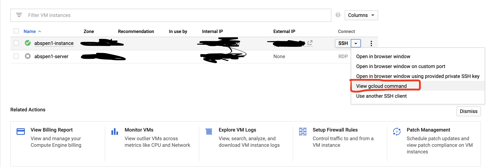
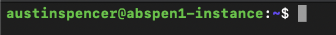

# Running on Google Cloud VM Instance

- First you need to set up your Google Cloud Instance
- When you set up a cloud account you will get $300 credit!
- You will need to go to [Google Cloud Platform](https://cloud.google.com/gcp/?utm_source=google&utm_medium=cpc&utm_campaign=na-US-all-en-dr-skws-all-all-trial-b-dr-1009135&utm_content=text-ad-none-any-DEV_c-CRE_109860918967-ADGP_Hybrid+%7C+AW+SEM+%7C+SKWS+%7C+US+%7C+en+%7C+Multi+~+Cloud-KWID_43700009609890930-kwd-19383198255&utm_term=KW_%2Bcloud-ST_%2Bcloud&&gclid=Cj0KCQjwv7L6BRDxARIsAGj-34qcziciZyZZMes6maVVBfg7lmWjgqQkUNXdwg8lHqQwTPVtNEWX0xoaAgGPEALw_wcB)
- Then to console where you can set up your compute engine
- Watch this video for help with inital setup [video](https://www.youtube.com/watch?v=p5wl1s5gKY0)
- You should only need machine-type f1-micro (1 vCPU, 0.6 GB memory)
  - **This will help make your $300 credit last longer**

## ssh into your vm instance

- I prefer to do this on my local machine but you can also do it in browser within a shell
- Install gcloud sdk on your local machine
  - [Instructions](https://cloud.google.com/sdk/docs/downloads-interactive)
- There will be a generated ssh that you can copy and paste into your terminal to ssh into your vm instance using gcloud
  
- Once you're inside your instance within your terminal it should look something like this
  

## Download Redis

- [Instructions](https://cloud.google.com/community/tutorials/setting-up-redis)
- Very easy and can be completed in < 10 minutes
- Be sure to create a secure password if you choose to configure remote access (recommended >= 32 characters)
- Find your external IP on your VM console (needed for the HOST env variable)

## Download Docker

- [Instructions](http://docs.h2o.ai/driverless-ai/latest-stable/docs/userguide/install/google-docker-container.html)
- My tl;dr instructions are below
- Note that you will likely need to add sudo infront of each command
  - Quickest way to fix this when you get the permission denied error
  - $ sudo !!
  - This is a shortcut to run previous command but with super user permissions

```bash
# SCRIPT FOR CPUs ONLY
apt-get -y update

# If you have issues with this command, omit python-software-properties
apt-get -y --no-install-recommends install \
  curl \
  apt-utils \
  python-software-properties \
  software-properties-common

add-apt-repository -y "deb [arch=amd64] https://download.docker.com/linux/ubuntu $(lsb_release -cs) stable"

# If you need to add sudo as prefix to these commands be sure to add sudo in front of the "apt-key add -"
curl -fsSL https://download.docker.com/linux/ubuntu/gpg | apt-key add -

apt-get update
apt-get install -y docker-ce
```

> Check that install worked

```bash
docker --version
```

- If this shows your docker version then you've successfully installed docker on your vm instance

## Clone your git repository to run within docker

- First check that git is installed

```bash
git --version
git clone https://github.com/abspen1/twitter-bot.git
ls (check that the repo cloned into your instance)
```

## Build the docker image

```bash
cd into twitter-bot directory
sudo docker build -t bot .
```

## Check if image was created

```bash
sudo docker image ls
```

## Run docker image in a container

```bash
sudo docker run -d \
  --name bot_name \
  --restart unless-stopped \
  -e CONSUMER_KEY="some consumer ID" \
  -e CONSUMER_SECRET="some consumer secret KEY" \
  -e KEY="some key ID" \
  -e SECRET="some secret key ID" \
  -e HOST="external ip address" \
  -e REDIS_PASS="some password" \
  -v $PWD:/work \
  bot
```

## Check that the container is running

```bash
sudo docker container ls
sudo docker logs bot_name
```

## Google Cloud Terminal Commands


